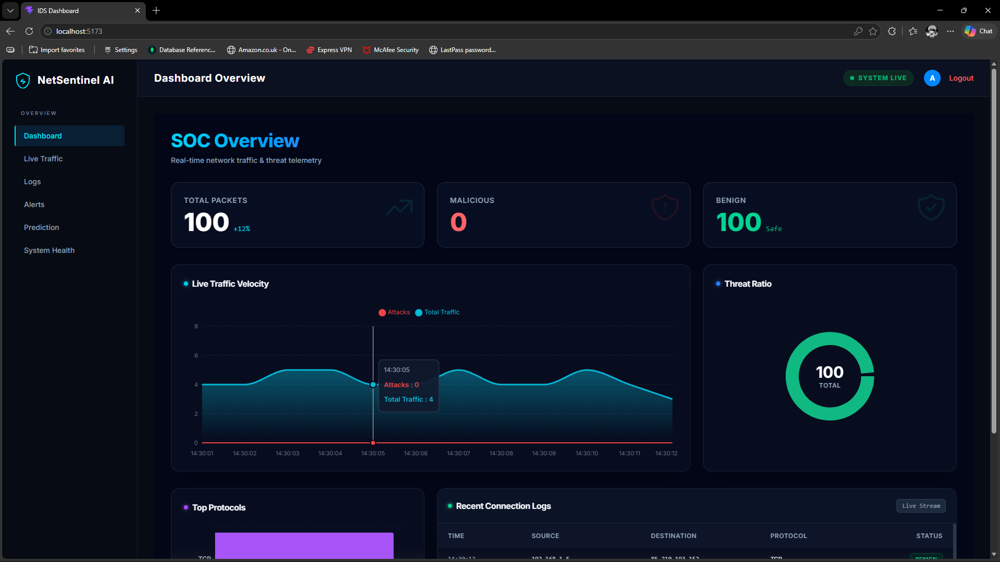
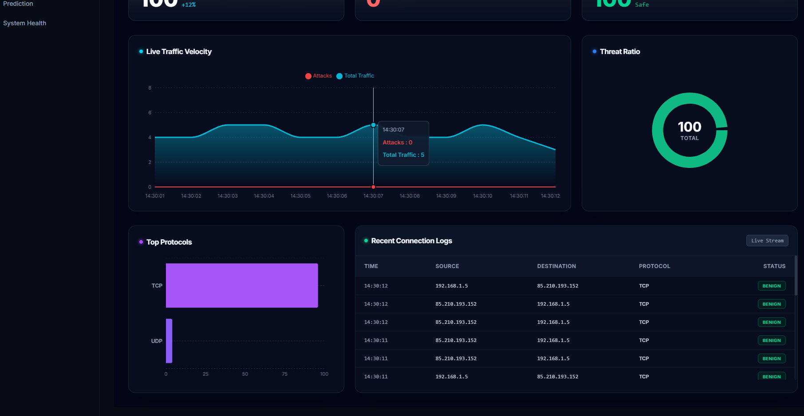
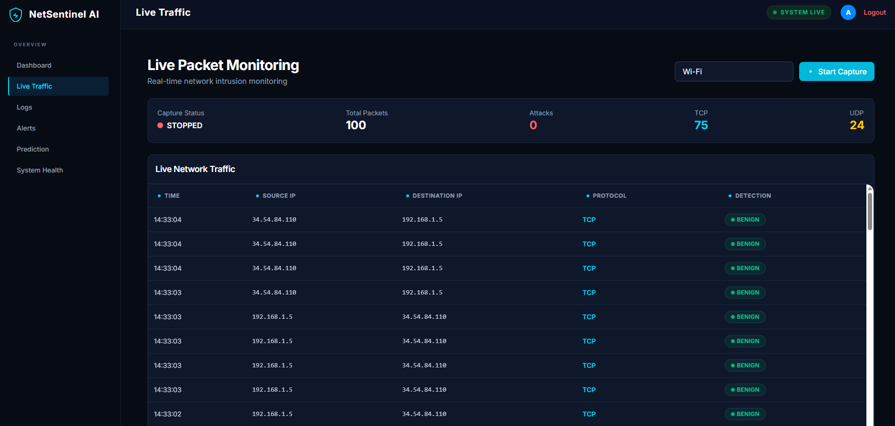
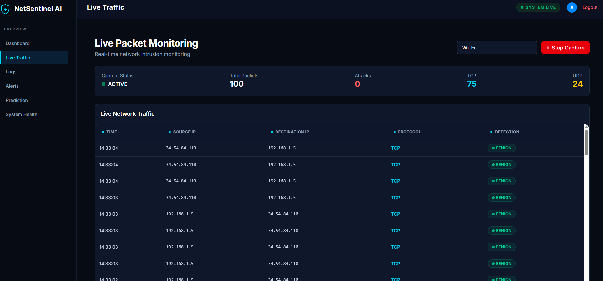
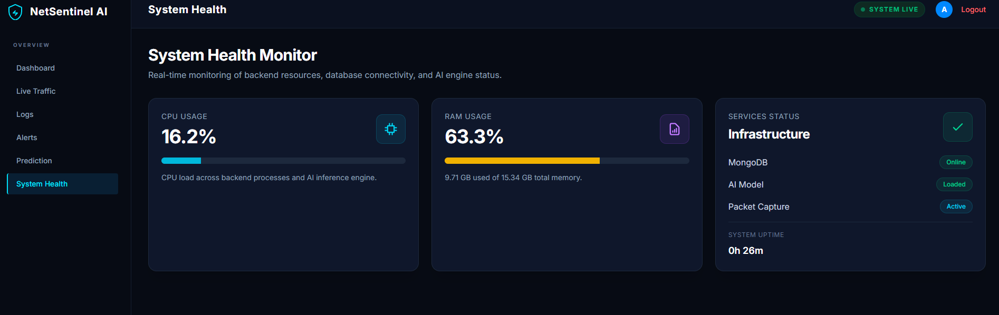
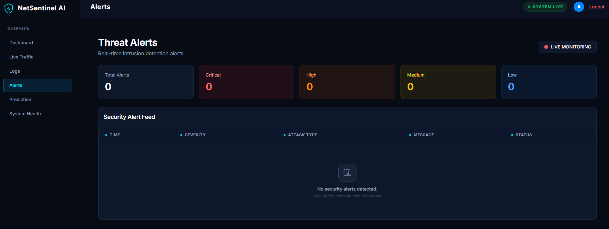

# 🛡️ Net_Sentinal_AI

### AI-Powered Network Intrusion Detection System (NIDS)


---

## 📖 Overview

**Net_Sentinal_AI** is an Artificial Intelligence-based Network Intrusion Detection System (NIDS) developed to identify and classify malicious network activities in real time.

The system leverages Machine Learning algorithms trained on the **CICIDS2017 dataset** to analyze network traffic patterns and detect cyber threats such as:

* Denial of Service (DoS) Attacks
* Brute Force Attacks
* Port Scanning
* Botnet Activities
* Suspicious Network Anomalies

The primary goal of this project is to demonstrate how Artificial Intelligence can enhance modern cybersecurity defenses by automating threat detection and reducing manual analysis efforts.

---

## 🎯 Project Objectives

* Detect malicious network traffic using Machine Learning techniques.
* Classify traffic as **Benign** or **Malicious**.
* Monitor network behavior through an interactive dashboard.
* Improve threat visibility for security analysts.
* Demonstrate practical implementation of AI in Cybersecurity.

---

## 🏗️ System Architecture

```text
Network Traffic
       │
       ▼
Data Collection
       │
       ▼
Data Preprocessing
       │
       ▼
Feature Engineering
       │
       ▼
Machine Learning Model
(Random Forest / Decision Tree)
       │
       ▼
Threat Detection Engine
       │
       ▼
Dashboard & Alerts
```

---

## 🧠 Machine Learning Pipeline

### Data Preprocessing

* Missing Value Handling
* Data Cleaning
* Feature Selection
* Label Encoding
* Normalization

### Model Training

The following Machine Learning algorithms were evaluated:

* Random Forest Classifier
* Decision Tree Classifier

### Performance Metrics

* Accuracy
* Precision
* Recall
* F1 Score
* Confusion Matrix

---

## 📊 Dataset

### CICIDS2017 Dataset

The model is trained using the **CICIDS2017 (Canadian Institute for Cybersecurity)** dataset, one of the most widely used benchmark datasets for intrusion detection research.

#### Dataset Includes

* Normal Network Traffic
* DoS Attacks
* DDoS Attacks
* Brute Force Attacks
* Botnet Traffic
* Port Scanning Activities
* Web-Based Attacks

> Note: Dataset files are not included in this repository due to their large size.

---

## 🚀 Key Features

✅ Real-Time Network Traffic Analysis

✅ Machine Learning-Based Attack Detection

✅ Network Threat Classification

✅ Interactive Monitoring Dashboard

✅ Automated Data Preprocessing Pipeline

✅ Security Event Visualization

✅ Extensible Detection Framework

---

## 🛠️ Technology Stack

### Backend

* Python
* Flask / FastAPI
* Pandas
* NumPy
* Scikit-Learn

### Machine Learning

* Random Forest
* Decision Tree
* Feature Engineering
* Data Preprocessing

### Frontend

* HTML5
* CSS3
* JavaScript
* Bootstrap

### Development Tools

* Git
* GitHub
* Visual Studio Code

---

## 📂 Project Structure

```text
Net_Sentinal_AI
│
├── backend
│   ├── app.py
│   ├── model_training.py
│   ├── detection_engine.py
│   ├── requirements.txt
│
├── frontend
│   ├── templates
│   ├── static
│   └── dashboard
│
├── dataset/
│   └── (excluded from repository)
│
├── models/
│   └── (trained models)
│
├── screenshots/
│
├── README.md
└── .gitignore
```

---

## ⚙️ Installation Guide

### 1. Clone Repository

```bash
git clone https://github.com/mgirish087-source/Net_Sentinal_AI.git
```

### 2. Navigate to Project Directory

```bash
cd Net_Sentinal_AI
```

### 3. Create Virtual Environment

```bash
python -m venv venv
```

### 4. Activate Environment

#### Windows

```bash
venv\Scripts\activate
```

#### Linux / macOS

```bash
source venv/bin/activate
```

### 5. Install Dependencies

```bash
pip install -r backend/requirements.txt
```

---

## ▶️ Running the Application

Start the backend server:

```bash
python backend/app.py
```

Open your browser:

```text
http://localhost:5000
```

---

## 🔍 Threats Detected

| Attack Type       | Description                   |
| ----------------- | ----------------------------- |
| DoS               | Resource exhaustion attacks   |
| DDoS              | Distributed Denial of Service |
| Brute Force       | Password guessing attacks     |
| Port Scan         | Network reconnaissance        |
| Botnet Activity   | Malicious automated traffic   |
| Anomalous Traffic | Unknown suspicious behavior   |

---

## 📈 Future Enhancements

* Real-Time Packet Capture using Scapy
* Deep Learning Models (LSTM, CNN)
* SIEM Integration
* Email & SMS Alert System
* Threat Intelligence Feeds
* Advanced Dashboard Analytics
* Cloud Deployment (AWS/Azure)

---
## Dashboard



## Dashboard 2



## Live Packet



## Live Packet 2



## System Health



## Threat Alerts



## 🔐 Cybersecurity Use Cases

* Security Operations Center (SOC)
* Enterprise Network Monitoring
* Threat Detection Research
* Academic Cybersecurity Projects
* Security Awareness Demonstrations

---

## 👨‍💻 Author

**Girish M**

Master of Computer Applications (MCA)

Cybersecurity & Cloud Computing Enthusiast

GitHub: https://github.com/mgirish087-source

LinkedIn: https://www.linkedin.com/in/girish-m-b8385b27a/

---

## 📜 License

This project is developed for **Educational, Research, and Learning Purposes**.

Feel free to use and modify the code for academic and non-commercial projects.

---

⭐ If you found this project useful, consider giving it a star on GitHub.
